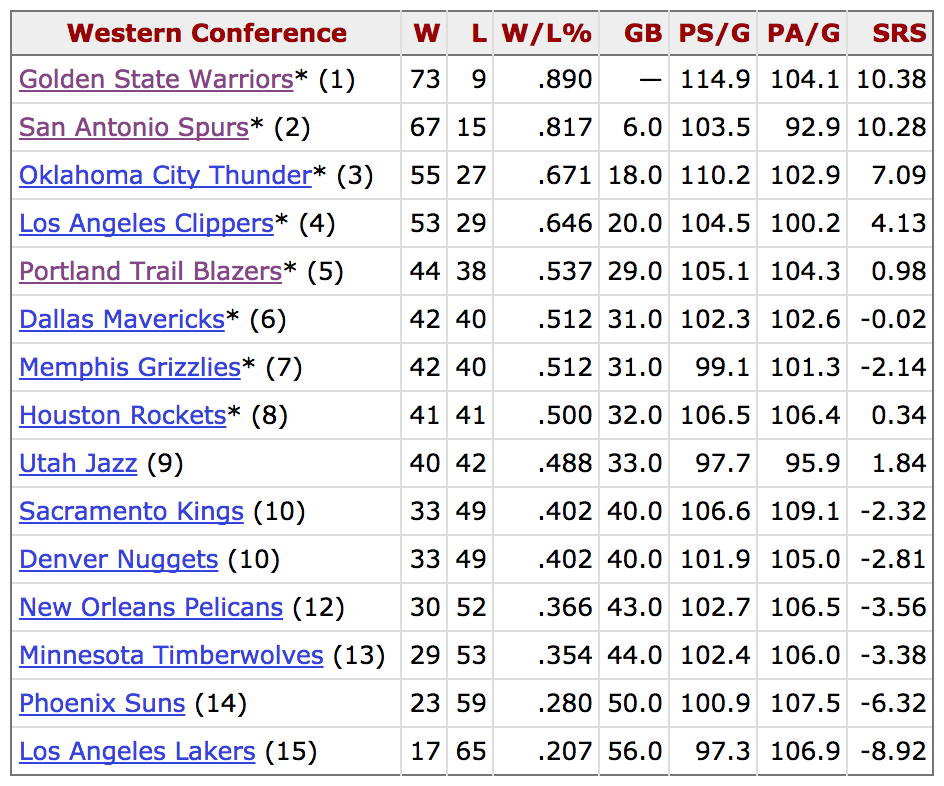

> ### Learning Objectives
>
> - Basics of vectors
> - Variables (as vectors and factors)
> - Quantitative variables as numeric vectors
> - Qualitative variables (as factors)
> - Manipulating vectors


```{r setup, include=FALSE}
knitr::opts_chunk$set(echo = TRUE)
```

## NBA Data

In this Rmd script we'll consider some NBA data from the website 
_Basketball Reference_. More specifically, let's look at the Western Conference 
Standings (season 2015-2016) shown in the following screenshot:

```{r out.width='60%', echo = FALSE, fig.align='center'}

```

source: [http://www.basketball-reference.com/leagues/NBA_2016.html#all_confs_standings_E](http://www.basketball-reference.com/leagues/NBA_2016.html#all_confs_standings_E)

The above table contains 15 rows with 8 columns. The first column contains the
names of the teams in the Western Conference, and the rest of the columns are:

- _W_: wins
- _L_: losses
- _W/L%_: win-loss percentange
- _GB_: games behind (the top team)
- _PS/G_: points per game
- _PA/G_: opponent points per game
- _SRS_: simple rating system

From the statistical standpoint, we say that the table has 8 variables measured
(or observed) on 15 individuals. In this case the "individuals" are the basketball 
teams.


## Basics of vectors

In order to use R as the computational tool in this course, you need to learn
how to input data. Before describing how to read in tables in R (we'll cover 
that later), we must talk about vectors.

R vectors are the most basic structure to store data in R. Virtually all other
data structures in R are based or derived from vectors. Using a vector is also
the most basic way to manually input data.

You can create vectors in several ways. The most common option is with the
function `c()` (combine). Simply pass a series of values separated by commas.
Here is how to create a vector `wins` with the first five values from the column
_W_ of the conference standings table:

```{r}
wins = c(73, 67, 55, 53, 44)
```

Likewise, we can create a vector `losses` like this:

```{r}
losses = c(9, 15, 27, 29, 38)
```

Having the vectors `wins` and `losses`, we can use them to create another
vector `win_loss_perc` for the column _W/L%_ (win-loss percentange):

```{r}
win_loss_perc = wins / (wins + losses)
win_loss_perc
```

You can think of vectors as variables. The previous vectors `wins`, `losses`,
and `win_loss_perc` are what it's known as __quantitative__ variables. This
means that each value in those variables (the numbers) reflect a quantity.

Not all variables are quantitative. For instance, the first column of the table
does not contain numbers but names. The name of a basketball team is referred
to as a __qualitative__ variable.

In R you can create a vector of names using a character vector. Again, we use 
the `c()` function and we pass it names surrounded by either single or double 
quotes. Here's how to create a vector `teams` with the names of the first five 
teams in the standings table:

```{r}
teams = c('GSW', 'SAS', 'OCT', 'LAC', 'PTB')
```

The vector `teams` is referred in R to as a __character vector__ because it 
is formed by characters.


## Manipulating Vectors: Subsetting

In addition to creating variables, you should also learn how to do some basic
manipulation of vectors. The most common type of manipulation  is called 
_subsetting_ which refers to extracting elements of a vector (or another R object). 
To do so, you use what is known as __bracket notation__. This implies using 
(square) brackets `[ ]` to get access to the elements of a vector. Inside the
brackets you can specify one or more numeric values that correspond to the
position(s) of the vector element(s):

```r
# first element of 'wins'
wins[1]

# third element of 'losses'
losses[3]

# last element of teams
teams[5]
```

Some common functions that you can use on vectors are:

- `length()` gives the number of values
- `sort()` sorts the values in increasing or decreasing ways
- `rev()` reverses the values

```r
length(teams)
teams[length(teams)]
sort(wins, decreasing = TRUE)
rev(wins)
```


### Subsetting with Logical Indices

In addition to using numbers inside the brackets, you can also do 
_logical subsetting_. This type of subsetting involves using a __logical__ 
vector inside the brackets. A logical vector is a particular type of vector 
that takes the special values `TRUE` and `FALSE`, as well as `NA` 
(Not Available).

This type of subsetting is very powerful because it allows you to 
extract elements based on some logical condition. 
Here are some examples of logical subsetting:

```r
# wins of Golden State Warriors
wins[teams == 'GSW']

# teams with wins > 40
teams[wins > 40]

# name of teams with losses between 10 and 29
teams[losses >= 10 & losses <= 29]
```


## Factors and Qualitative Variables

As mentioned before, vectors are the most essential type of data structure
in R. Related to vectors, there is another important data structure in R called
__factor__. Factors are data structures exclusively designed to handle 
qualitative or categorical data.

The term _factor_ as used in R for handling categorical variables, comes from 
the terminology used in _Analysis of Variance_, commonly referred to as ANOVA. 
In this statistical method, a categorical variable is commonly referred to as 
_factor_ and its categories are known as _levels_.

To create a factor you use the homonym function `factor()`, which takes a 
vector as input. The vector can be either numeric, character or logical. 

```{r}
# numeric vector
num_vector <- c(1, 2, 3, 1, 2, 3, 2)

# creating a factor from num_vector
first_factor <- factor(num_vector)

first_factor
```

You can take the `teams` vector and convert it as a factor:

```{r}
teams = factor(teams)
teams
```


## Sequences

It is very common to generate sequences of numbers. For that R provides: 

- the colon operator `":"`
- sequence function `seq()`

```r
# colon operator
1:5
1:10
-3:7
10:1
```

```r
# sequence function
seq(from = 1, to = 10)
seq(from = 1, to = 10, by = 1)
seq(from = 1, to = 10, by = 2)
seq(from = -5, to = 5, by = 1)
```


### Repeated Vectors

There is a function `rep()`. It takes a vector as the main input, and then it
optionally takes various arguments: `times`, `length.out`, and `each`.

```{r}
rep(1, times = 5)        # repeat 1 five times
rep(c(1, 2), times = 3)  # repeat 1 2 three times
rep(c(1, 2), each = 2)
rep(c(1, 2), length.out = 5)
```

Here are some more complex examples:

```r
rep(c(3, 2, 1), times = 3, each = 2)
```


## From vectors to data frames

Now that we've seen how to create some vectors and do some basic manipulation,
we can describe how to combine them in a table in R. The standard tabular 
structure in R is a __data frame__. To manually create a data frame you use 
the function `data.frame()` and you pass it one or more vectors. Here's how
to create a small data frame `dat` with the vectors `teams`, `wins`, `losses`, 
and `win_loss_perc`:

```{r}
dat = data.frame(
  Teams = teams,
  Wins = wins,
  Losses = losses,
  WLperc = win_loss_perc
)

dat
```

Manipulating data frames is more complex than manipulating vectors. However,
manipulating the column of a data frame is essentially the same as manipulating
a vector. 

There are a couple of ways to "select" a column of a data frame. One option
consists of using the dollar `$` operator. This involves typing the name of 
the data frame, followed by the `$`, followed by the name of the column.
For instance, to extract the values in column `Teams` simply type:

```{r}
dat$Teams
```

Moreover, you can use bracket notation on the extracted column like with any
type of vector:

```{r}
dat$Wins[1]
dat$Wins[5]
```

Likewise, you can do logical subsetting:

```r
# wins of Golden State Warriors
dat$Wins[dat$Teams == 'GSW']

# teams with wins > 40
dat$Teams[dat$Wins > 40]

# name of teams with losses between 10 and 29
dat$Teams[dat$Losses >= 10 & dat$Losses <= 29]
```
